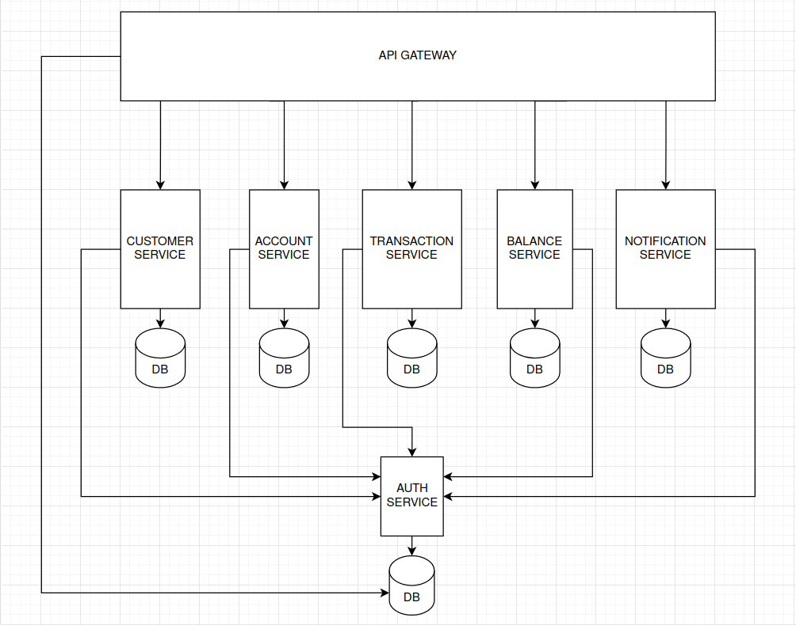
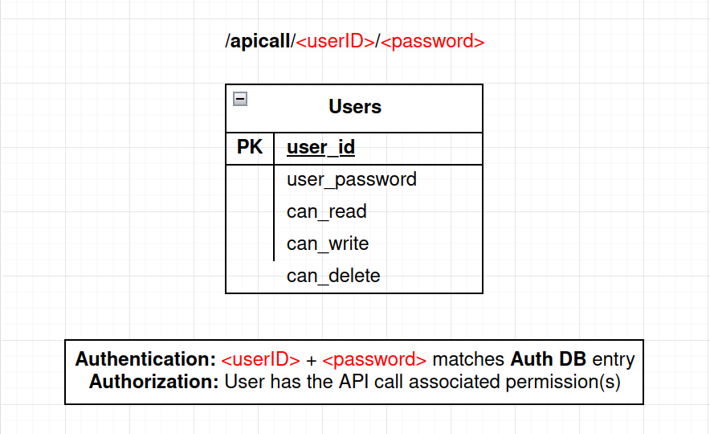

# Microservices Auth Benchmark

## Application Architecture



## Auth Mechanism



## Service Endpoints

### Customer Service

#### `/createCustomer`

**Request Body**
```json
{
    "customerName": "Alice",
    "customerEmail": "alice@gmail.com"
}
```
**Response Body**
```json
{
    "message": "success",
    "customerID": 1,
    "accountID": 1
}
```

#### `/deleteCustomer`

**Request Body**
```json
{
    "customerID": 1
}
```
**Response Body**
```json
{
    "message": "success",
    "customerID": 1,
    "accountIDs": [1, 2, 3]
}
```

#### `/getCustomer`

**Request Body**
```json
{
    "customerID": 1
}
```
**Response Body**
```json
{
    "message": "success",
    "customerID": 1,
    "customerName": "Alice",
    "customerEmail": "alice@gmail.com"
}
```

### Account Service

#### `/createAccount`

**Request Body**
```json
{
    "customerID": 1
}
```
**Response Body**
```json
{
    "message": "success",
    "accountID": 1
}
```

#### `/deleteAccount`

**Request Body**
```json
{
    "accountID": 1
}
```
**Response Body**
```json
{
    "message": "success",
    "accountID": 1
}
```

#### `/deleteAccountsByCustomer`

**Request Body**
```json
{
    "customerID": 1
}
```
**Response Body**
```json
{
    "message": "success",
    "customerID": 1,
    "accountIDs": [1, 2, 3]
}
```

#### `/getAccount`

**Request Body**
```json
{
    "accountID": 1
}
```
**Response Body**
```json
{
    "message": "success",
    "accountID": 1,
    "customerID": 1,
    "balance": 100
}
```

#### `/getAccountsByCustomer`

**Request Body**
```json
{
    "customerID": 1
}
```
**Response Body**
```json
{
    "message": "success",
    "customerID": 1,
    "accountIDs": [1, 2, 3],
    "balances": [100, 50, 10]
}
```

#### `/addToBalance`

**Request Body**
```json
{
    "accountID": 1,
    "amount": 50
}
```
**Response Body**
```json
{
    "message": "success",
    "accountID": 1,
    "amountAdded": 50
}
```

#### `/subtractFromBalance`

**Request Body**
```json
{
    "accountID": 1,
    "amount": 50
}
```
**Response Body**
```json
{
    "message": "success",
    "accountID": 1,
    "amountSubtracted": 50
}
```

### Transaction Service

#### `/transferAmount`

**Request Body**
```json
{
    "senderID": 1,
    "receiverID": 2,
    "amount": 50
}
```
**Response Body**
```json
{
    "message": "success",
    "transactionID": 1,
    "senderID": 1,
    "receiverID": 2
}
```

#### `/transferAmountAndNotify`

**Request Body**
```json
{
    "senderID": 1,
    "receiverID": 2,
    "amount": 50
}
```
**Response Body**
```json
{
    "message": "success",
    "transactionID": 1,
    "senderID": 1,
    "receiverID": 2,
    "notificationID": 1
}
```

#### `/getTransaction`

**Request Body**
```json
{
    "transactionID": 1
}
```
**Response Body**
```json
{
    "message": "success",
    "transactionID": 1,
    "senderID": 1,
    "receiverID": 2,
    "amount": 50
}
```

### Notification Service

#### `/notify`

**Request Body**
```json
{
    "transactionID": 1,
    "receiverID": 2,
    "amount": 50
}
```
**Response Body**
```json
{
    "message": "success",
    "notificationID": 1,
    "recipientEmail": "bob@gmail.com"
}
```

#### `/getNotification`

**Request Body**
```json
{
    "notificationID": 1
}
```
**Response Body**
```json
{
    "message": "success",
    "notificationID": 1,
    "transactionID": 1,
    "receiverID": 2,
    "amount": 50
}
```

### Balance Service

#### `/getBalanceByCustomer`

**Request Body**
```json
{
    "customerID": 1
}
```
**Response Body**
```json
{
    "message": "success",
    "customerID": 1,
    "accountIDs": [1, 2, 3],
    "balances": [100, 50, 10],
    "totalBalance": 160
}
```

#### `/getBalanceHistory`

**Request Body**
```json
{
    "customerID": 1,
    "numberOfRecords": 5
}
```
**Response Body**
```json
{
    "message": "success",
    "customerID": 1,
    "totalBalance": [30, 50, 80, 120, 160],
    "recordTimestamps": ["2024-01-15 12:00:00", "2024-01-15 15:30:00", "2024-01-16 08:45:00", "2024-01-17 10:00:00", "2024-01-18 18:20:00"]
}
```

## Inter-Service Communication

### Account Service

- Account Service &rarr; **Create Account**

- Account Service &rarr; **Delete Account**

- Account Service &rarr; **Delete Accounts By Customer**

- Account Service &rarr; **Add To Balance**

- Account Service &rarr; **Subtract From Balance**

- Account Service &rarr; **Get Account**

- Account Service &rarr; **Get Accounts By Customer**

### Customer Service

- Customer Service &rarr; **Create Customer**
    - Account Service &rarr; **Create Account**

- Customer Service &rarr; **Delete Customer**
    - Account Service &rarr; **Delete Accounts By Customer**

- Customer Service &rarr; **Get Customer**

### Balance Service

- Balance Service &rarr; **Get Balance By Customer**
    - Account Service &rarr; **Get Accounts By Customer**

- Balance Service &rarr; **Get Balance History**

### Notification Service

- Notification Service &rarr; **Notify**
    - Account Service &rarr; **Get Account**
    - Customer Service &rarr; **Get Customer**

- Notification Service &rarr; **Get Notification**

### Transaction Service

- Transaction Service &rarr; **Transfer Amount**
    - Account Service &rarr; **Add To Balance**
    - Account Service &rarr; **Subtract From Balance**

- Transaction Service &rarr; **Transfer Amount And Notify**
    - Account Service &rarr; **Add To Balance**
    - Account Service &rarr; **Subtract From Balance**
    - Notification Service &rarr; **Notify**
        - Account Service &rarr; **Get Account**
        - Customer Service &rarr; **Get Customer**

- Transaction Service &rarr; **Get Transaction**

## Operation Types

- **Create Customer** &rarr; `WRITE`

- **Delete Customer** &rarr; `DELETE`

- **Get Customer** &rarr; `READ`

- **Create Account** &rarr; `WRITE`

- **Delete Account** &rarr; `DELETE`

- **Delete Accounts By Customer** &rarr; `DELETE`

- **Get Account** &rarr; `READ`

- **Get Accounts By Customer** &rarr; `READ`

- **Add To Balance** &rarr; `WRITE`

- **Subtract From Balance** &rarr; `WRITE`

- **Transfer Amount** &rarr; `WRITE`

- **Transfer Amount And Notify** &rarr; `WRITE`

- **Get Transaction** &rarr; `READ`

- **Notify** &rarr; `WRITE`

- **Get Notification** &rarr; `READ`

- **Get Balance By Customer** &rarr; `READ`

- **Get Balance History** &rarr; `READ`